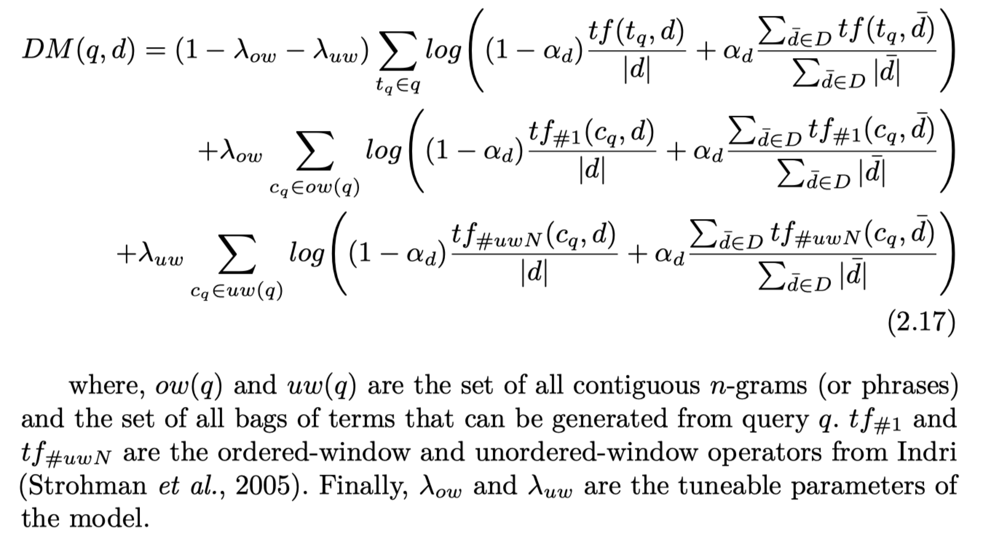

```
作者：Bhaskar Mitra and Nick Craswell

单位：微软
```

#### 引言

- 信息检索的输入（关键词、自然语言、语音、图片）和输出（document、answer、response generation）都有很多种形式，可以是同一模态也可以是不同模态。【**本文的讨论点集中在对一个较短的query，排序document或者文本段**】

- 当query有歧义时，还可以考虑用户搜索历史、物理位置、时间等因素。
- IR任务除了共享NLP领域的一些共同属性，还有其自身的特点和挑战：1）short query，且包含OOV；2）document的长度变化范围大，且相关文档也可能包含大段的不相关内容；3）需要学习代表相关的模式，这种模式可能是task-specific或者context-specific；4）词汇鸿沟问题。


#### 文本检索基础

- ##### IR task
  
  - Ad-hoc retrieval
  
    > 搜索引擎的query一般比较短。使用倒排索引实现大规模工业应用。
    >
    > 可以使用的隐式反馈包括：点击、停留时间。
    >
    > 常用的排序特征：1）文档自身的特征；2）query与文档的匹配度；3）query与文档元信息的匹配度，元信息包括其他网页中指向该网页的链接锚文字或者其他用户点击该网页时使用的query。
  
  - QA
  
    > 形式包括：候选答案排序、answer span抽取、答案生成。。。。**本文仅考虑候选答案排序。**
    >
    > 文本片段排序与整个文档排序不同，其特征包括：1）排序的对象比较短，可能只针对query的单个topic；2）容易出现词汇不匹配问题；3）需要根据question的意图，建模所期望的answer的模式。
  
- ##### IR 模型需要具备的能力

  - 相关性：精确匹配、相关匹配
  - 鲁棒性：对rare input（query中含有稀疏词）的鲁棒性；对corpus变化的鲁棒性（通常训练好的模型的测试环境和训练环境分布不同，而且互联网上的文档集合是一直变化的）；对文档长度的鲁棒性（相关性的判断不能偏向于过长或过短的文档）；对输入错误的鲁棒性（传统的IR模型通常用一个特定模块进行错误纠正，但neural model通常使用其他策略，例如character-level、从噪声文本中学表达）。
  - 敏感性：对上下文的敏感性，例如时间、地理位置、用户个人信息
  - 效率性：实际应用上必须高效。

- ##### 常用指标

  - Precision
  - Recall
  - MAP
  - MRR
  - NDCG

- ##### 传统的IR模型

  - **BM25**（理论基础是概率模型）：

    仅考虑每个单词的精确匹配贡献，忽略了词组或者近似匹配信号。
    $$
    B M 25(q, d)=\sum_{t_{q} \in q} i d f\left(t_{q}\right) \cdot \frac{t f\left(t_{q}, d\right) \cdot\left(k_{1}+1\right)}{t f\left(t_{q}, d\right)+k_{1} \cdot\left(1-b+b \cdot \frac{|d|}{a v g d l}\right)}   \\
    i d f(t)=\log \frac{|D|-d f(t)+0.5}{d f(t)+0.5}
    $$

  - **语言模型**（建模文档的后验概率）

    仅考虑词的精确匹配，忽略了出现的位置或者近似匹配信号。
    $$
    \begin{aligned} p(d | q) &=\frac{p(q | d) \cdot p(d)}{\sum_{\bar{d} \in D} p(q | \bar{d}) \cdot p(\bar{d})} \\ & \propto p(q | d) \cdot p(d) \\ &=p(q | d) \quad, \text { assuming } \mathrm{p}(\mathrm{d}) \text { is uniform } \\ &=\prod_{t_{q} \in q} p\left(t_{q} | d\right) \end{aligned}    \\
    p\left(t_{q} | d\right)=\frac{t f\left(t_{q}, d\right)}{|d|}   \\
    
    一些平滑处理方法： 
    \begin{array}{l}{ \text { 1. Jelinek-Mercer smoothing }} \\ {\qquad p\left(t_{q} | d\right)=\left(\lambda \frac{t f\left(t_{q}, d\right)}{|d|}+(1-\lambda) \frac{\sum_{\bar{d} \in D} t f\left(t_{q}, \bar{d}\right)}{\sum_{\bar{d} \in D}|\bar{d}|}\right)} \\ { \text { 2. Dirichlet Prior Smoothing}} \\ {\qquad p\left(t_{q} | d\right)=\left(t f\left(t_{q}, d\right)+\mu \frac{\sum_{\bar{d} \in D} t f\left(t_{q}, \bar{d}\right)}{\sum_{\bar{d} \in D}|\bar{d}|}\right) /(|d|+\mu)}\end{array}
    $$

  - **翻译模型**

    缓解词汇鸿沟问题。 $p\left(t_{q} | t_{d}\right)$ 允许从非query term的document term中收集证据。该概率的计算可以借鉴机器翻译中的短语翻译概率计算方法。
    $$
    p\left(t_{q} | d\right)=\sum_{t_{d} \in d} p\left(t_{q} | t_{d}\right) \cdot p\left(t_{d} | d\right)
    $$

  - **依存模型**

    考虑词组匹配。基于近似匹配特征，，没太看懂。

    

  - **伪相关反馈**：可以缓解词汇鸿沟问题。


#### 无监督学习的 term representation

- term representation

  不同的方法得到的表示可能捕捉的是不同的特征或关系；有不同的泛化水平；源于不同的内在的相似度概念/假设；有些需要固定的词典，有些打破了这个限制；对于如何形成更大文本单元的表示，有不同的组合属性。

- 相似度概念

  常用的相似性概念的不同分类：typical（又名Paradigmatic） 和 topical（又名Syntagmatic）。

- 分布式表示

  - observed feature space：例如TFIDF向量。可以使用简单的向量运算来进行term类比任务。但是缺点在于，向量表示是高维稀疏的，对很多任务不太方便使用。
  - latent feature space：LSA、PLSA、Word2Vec、Glove、Passage2Vec


#### Term embedding for IR

- query-document matching

  关键在于要选择适合检索场景的term representation。不同的模型所捕捉的是不同类型的相似性，例如PV模型考虑term-document对，一般捕捉的是topical similarity；word2vec和glove一般融合topical和typical两种。

  > Dual Embedding Space Model(DESM)
  >
  > 该研究指出，在用word2vec方法评估query和document的相关性时，query的词应该用IN-embedding，document的词应该用OUT-embedding。（注，一般的做法是word2vec都用IN-embedding）。

  有了word embedding之后，最开始的一些工作是在传统方法的计算公式中融入embedding的cos计算。这样就可以弥补传统方法中不含inexact matching信号的缺点。

  Embedding based model当在全文档集合进行检索时效果比较差。

  Embedding based model 和 exact matching model 的错误是不同的，通常结合两种范式可以得到更好的结果。后来也逐渐形成exact matching model for ranking + embedding based model for reranking的pipeline范式。

- query expandation

  仅基于term embedding的问题扩展没有伪相关反馈的性能好，但可以和伪相关反馈相结合以取得更好的结果。

  > Diaz, F., B. Mitra, and N. Craswell. 2016. “Query Expansion with Locally-Trained Word Embeddings”. In: Proc. ACL.
  >
  > Roy, D., D. Paul, M. Mitra, and U. Garain. 2016. “Using Word Embeddings for Automatic Query Expansion”. arXiv preprint arXiv:1606.07608.


#### 有监督学习 for ranking

- 输入特征

  - query independent feature
  - query dependent feature
  - query-level feature

- Loss 函数

  - pointwise 方法

    - regression loss：$\mathcal{L}_{\text {squared }}=\left\|r e l_{q}(d)-s\left(\vec{x}_{q, d}\right)\right\|^{2}$
    - classification loss：$\mathcal{L}_{\text {classification }}=-\log \left(p\left(y_{q, d} | q, d\right)\right)=-\log \left(\frac{e^{\gamma \cdot s\left(\vec{x}_{q, d}, y_{q, d}\right)}}{\sum_{y \in Y} e^{\gamma \cdot s\left(\vec{x}_{q, d}, y\right)}}\right)$

  - 直接最大化正例的得分

    - Contrastive loss：
      $$
      \begin{aligned} \mathcal{L}_{\text {Contrastive }}\left(q, d, y_{q, d}\right) &=y_{q, d} \cdot \frac{1}{2}\left(\max \left(0, m-\operatorname{dist}_{q, d}\right)\right)^{2} \\ &+\left(1-y_{q, d}\right) \cdot\left(\operatorname{dist}_{q, d}\right)^{2} \\ \text { where, } m \text { is a margin. } \end{aligned}
      $$

    - Cross-Entropy loss over documents：
      $$
      \begin{aligned} \mathcal{L}_{\mathrm{CE}}\left(q, d^{+}, D\right) &=-\log \left(p\left(d^{+} | q\right)\right) \\ &=-\log \left(\frac{e^{\gamma \cdot s}\left(q, d^{+}\right)}{\sum_{d \in D} e^{\gamma \cdot s(q, d)}}\right) \end{aligned}
      $$

      > 在全局上计算softmax的复杂度过高，一些优化方法：
      >
      > Hierarchical softmax
      >
      > Importance sampling
      >
      > Noise Contrastive Estimation
      >
      > Negative sampling

  - pairwise 方法

    - hinge loss

    - RankNet loss：
      $$
      p_{i j} \equiv p\left(s_{i}>s_{j}\right) \equiv \frac{1}{1+e^{-\sigma\left(s_{i}-s_{j}\right)}}  \\
      \begin{aligned} \mathcal{L} &=-\bar{p}_{i j} \log \left(p_{i j}\right)-\left(1-\bar{p}_{i j}\right) \log \left(1-p_{i j}\right) \\ &=\frac{1}{2}\left(1-S_{i j}\right) \sigma\left(s_{i}-s_{j}\right)+\log \left(1+e^{-\sigma\left(s_{i}-s_{j}\right)}\right) \\ &=\log \left(1+e^{-\sigma\left(s_{i}-s_{j}\right)}\right) \text { if, } d_{i} \underset{q}{_{q}} d_{j}\left(S_{i j}=1\right) \end{aligned}
      $$

  - listwise 方法
    - LambdaRank loss：$\lambda_{LambdaRank}=\lambda_{R a n k N e t} \cdot|\Delta N D C G|$ 
    - ListNet and listMLE loss

#### 

#### DNN for IR

区分短文本匹配和长文本匹配很重要，他们需要面临的匹配模式不一样。

输入的文本不同、训练方式不同，也会导致学到的相关性类型不同。

- document autoencoder：例如 Semantic Hashing 
- siamese network：例如 DSSM
- interaction-based network：例如 DRMM。对于可能包含多个topic的长文本，这种基于交互的方式会更好。
- lexical and semantic matching：例如 DUET。 结合精确匹配和非精确匹配。精确匹配对于rare query term尤其重要。
- Matching with multiple document fields：有些研究表明，对不同的域，用非共享的模型效果会更好。

文本的超链接锚文字等也是重要的文本特征。


